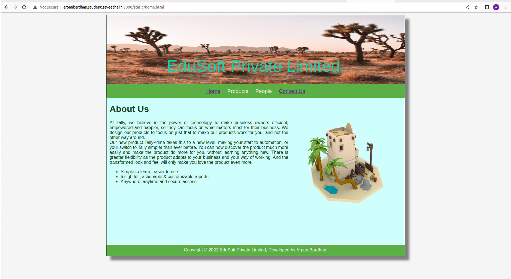
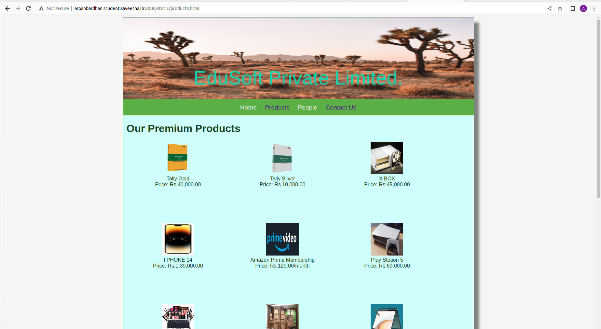
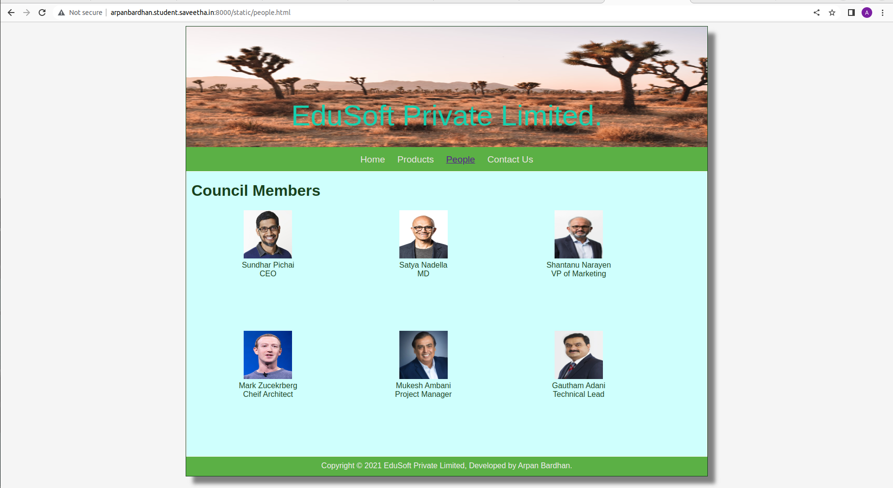
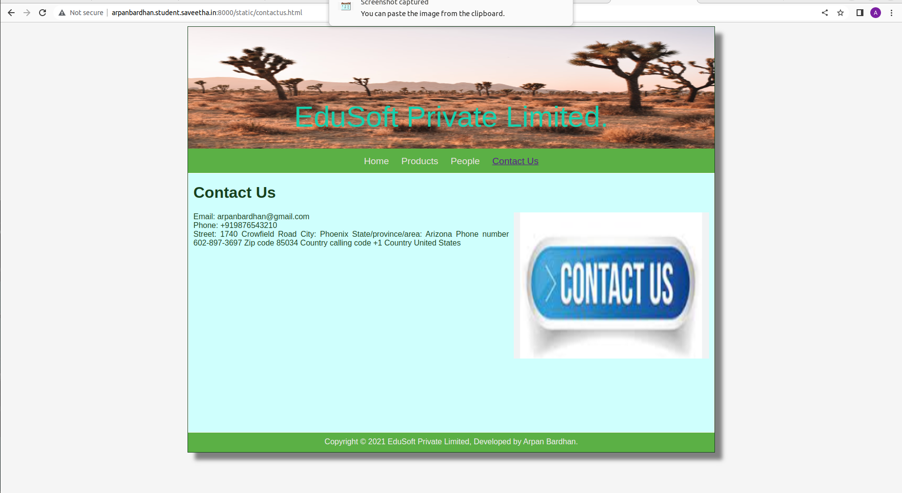
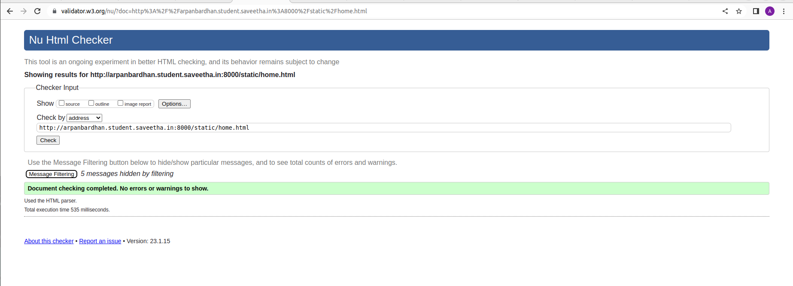

# Web Design for a Software Product Company

## AIM:

To design a static website for a software product company company.

## DESIGN STEPS:

### Step 1:

Requirement collection.

### Step 2:

Creating the layout using HTML and CSS.

### Step 3:

Updating the sample content.

### Step 4:

Choose the appropriate style and color scheme.

### Step 5:

Validate the layout in various browsers.

### Step 6:

Validate the HTML code.

### Step 6:

Publish the website in the given URL.

## PROGRAM :
```
home.html
<!DOCTYPE html>
<html lang="en">

<head>
    <title>EduSoft Private Limited</title>
    <link rel="stylesheet" href="./css/layout.css" />
    <link rel="icon" href="./img/icon.png" type="image/x-icon" />
</head>

<body>
    <div class="container">
        <div class="banner">EduSoft Private Limited.</div>
        <div class="menu">
            <div class="menuitemselected"><a href="/static/home.html">Home</a></div>
            <div class="menuitem"><a href="/static/products.html">Products</a></div>
            <div class="menuitem"><a href="/static/people.html">People</a></div>
            <div class="menuitemselected"><a href="/static/contactus.html">Contact Us</a></div>
        </div>
        <div class="content">
            <div class="homecontent">
                <h1>About Us</h1>
                
                <div class="contenttext">
                    At Tally, we believe in the power of technology to make business
                    owners efficient, empowered and happier, so they can focus on what
                    matters most for their business. We design our products to focus on
                    just that to make our products work for you, and not the other way
                    around.
                    <br />
                    Our new product TallyPrime takes this to a new level, making your
                    start to automation, or your switch to Tally simpler than ever
                    before. You can now discover the product much more easily and make
                    the product do more for you, without learning anything new. There is
                    greater flexibility as the product adapts to your business and your
                    way of working. And the transformed look and feel will only make you
                    love the product even more.
                    <ul>
                        <li>Simple to learn, easier to use</li>
                        <li>Insightful , actionable & customizable reports</li>
                        <li>Anywhere, anytime and secure access</li>
                    </ul>
                </div>
            </div>
        </div>
        <div class="footer">
            Copyright &#169; 2021 EduSoft Private Limited, Developed by Surya.T.
        </div>
    </div>
</body>

</html>
```
```
people.html

<!DOCTYPE html>
<html lang="en">
  <head>
    <title>Edusoft Private Limited</title>
    <link rel="stylesheet" href="./css/layout.css" />
    <link rel="icon" href="./img/icon.png" type="image/x-icon" />
  </head>

  <body>
    <div class="container">
      <div class="banner">EduSoft Private Limited.</div>
      <div class="menu">
        <div class="menuitem"><a href="/static/home.html">Home</a></div>
        <div class="menuitem">
          <a href="/static/products.html">Products</a>
        </div>
        <div class="menuitemselected"><a href="/static/people.html">People</a></div>
        <div class="menuitem"><a href="/static/contactus.html">Contact Us</a></div>
      </div>
      <div class="content">
        <div class="productcontent">    
          <h1>Council Members</h1>
          <div class="productitem"> 
          <div class="itemimage">
          
          </div>
          <div class="itemname">Sundhar Pichai</div>
          <div class="itemprice">CEO</div>
        </div>
        <div class="productitem"> 
          <div class="itemimage">
          
          </div>
          <div class="itemname">Satya Nadella</div>
          <div class="itemprice">MD</div>
        </div>
        <div class="productitem"> 
          <div class="itemimage">
          
          </div>
          <div class="itemname">Shantanu Narayen</div>
          <div class="itemprice">VP of Marketing</div>
        </div>
        <div class="productitem"> 
          <div class="itemimage">
          
          </div>
          <div class="itemname">Mark Zucekrberg</div>
          <div class="itemprice">Cheif Architect</div>
      </div>
      <div class="productitem"> 
        <div class="itemimage">
        
        </div>
        <div class="itemname">Mukesh Ambani</div>
        <div class="itemprice">Project Manager</div>
      </div>
      <div class="productitem"> 
      <div class="itemimage">
      
      </div>
      <div class="itemname">Gautham Adani</div>
      <div class="itemprice">Technical Lead</div>
      </div>
      </div>
        </div>
      <div class="footer">
        Copyright &#169; 2021 EduSoft Private Limited, Developed by Surya.T.
    </div>    
      </div>
    </div>
  </body>
</html>
```
```
contactus.html

<!DOCTYPE html>
<html lang="en">
  <head>
    <title>EduSoft Private Limited</title>
    <link rel="stylesheet" href="./css/layout.css" />
    <link rel="icon" href="./img/icon.png" type="image/x-icon" />
  </head>

  <body>
    <div class="container">
      <div class="banner">EduSoft Private Limited.</div>
      <div class="menu">
        <div class="menuitem"><a href="/static/home.html">Home</a></div>
        <div class="menuitem"><a href="/static/products.html">Products</a></div>
        <div class="menuitem"><a href="/static/people.html">People</a></div>
        <div class="menuitemselected"><a href="/static/contactus.html">Contact Us</a></div>
      </div>
      <div class="content">
        <div class="homecontent">
          <h1>Contact Us</h1>
          
          <div class="contenttext">
            Email: arpanbardhan@gmail.com
            <br>
            Phone: +919876543210
            <br>
            Street:  1740 Crowfield Road

            City:  Phoenix

            State/province/area:   Arizona

            Phone number  602-897-3697

            Zip code  85034

            Country calling code  +1

            Country  United States

          </div>
        </div>
      </div>
      <div class="footer">
        Copyright &#169; 2021 EduSoft Private Limited, Developed by Surya.T.
      </div>
    </div>
  </body>
</html>
```
```
products.html

<!DOCTYPE html>
<html lang="en">
  <head>
    <title>EduSoft Private Limited</title>
    <link rel="stylesheet" href="./css/layout.css" />
    <link rel="icon" href="./img/icon.png" type="image/x-icon" />
  </head>

  <body>
    <div class="container">
      <div class="banner">EduSoft Private Limited.</div>
      <div class="menu">
        <div class="menuitem"><a href="/static/home.html">Home</a></div>
        <div class="menuitemselected">
          <a href="/static/products.html">Products</a>
        </div>
        <div class="menuitem"><a href="/static/people.html">People</a></div>
        <div class="menuitemselected"><a href="/static/contactus.html">Contact Us</a></div>
      </div>
      <div class="content">
        <div class="productcontent">    
          <h1>Our Premium Products</h1>
          <div class="productitems">
              <div class="productitem"> 
                  <div class="itemimage">
                  
                  </div>
                  <div class="itemname">Tally Gold</div>
                  <div class="itemprice">Price: Rs.40,000.00 </div>
              </div>
              <div class="productitem"> 
                  <div class="itemimage">
                  
                  </div>
                  <div class="itemname">Tally Silver</div>
                  <div class="itemprice">Price: Rs.10,000.00 </div>
              </div>
              <div class="productitem">
                  <div class="itemimage">
                      
                  </div>
                  <div class="itemname">X BOX</div>
                  <div class="itemprice">Price: Rs.45,000.00 </div>
              </div>
              <div class="productitem">
                  <div class="itemimage">
                      
                  </div>
                  <div class="itemname">I PHONE 14</div>
                  <div class="itemprice">Price: Rs.1,39,000.00 </div>
              </div>
              <div class="productitem">
                  <div class="itemimage">
                      
                  </div>
                  <div class="itemname">Amazon Prime Membership</div>
                  <div class="itemprice">Price: Rs.129.00/month </div>
              </div>
              <div class="productitem">
                  <div class="itemimage">
                      
                  </div>
                  <div class="itemname">Play Station 5</div>
                  <div class="itemprice">Price: Rs.69,000.00 </div>
              </div>
              <div class="productitem">
                  <div class="itemimage">
                      
                  </div>
                  <div class="itemname">Makeup Kit</div>
                  <div class="itemprice">Price: Rs.5,000.00 </div>
              </div>
              <div class="productitem">
                  <div class="itemimage">
                      
                  </div>
                  <div class="itemname">Miniature Ship</div>
                  <div class="itemprice">Price: Rs.4,500.00 </div>
              </div>
              <div class="productitem">
                  <div class="itemimage">
                      
                  </div>
                  <div class="itemname">Lenovo Yoga 6</div>
                  <div class="itemprice">Price: Rs.86,000.00 </div>
              </div>
              <div class="productitem">
                  <div class="itemimage">
                      
                  </div>
                  <div class="itemname">Nerf Gun</div>
                  <div class="itemprice">Price: Rs.1,000.00 </div>
              </div>
              <div class="productitem">
                  <div class="itemimage">
                      
                  </div>
                  <div class="itemname">Doge Coin</div>
                  <div class="itemprice">Price: Rs.7.04/coin </div>
              </div>
              <div class="productitem">
                  <div class="itemimage">
                      
                  </div>
                  <div class="itemname">Trimmer</div>
                  <div class="itemprice">Price: Rs.900.00 </div>
              </div>
              <div class="productitem">
                  <div class="itemimage">
                      
                  </div>
                  <div class="itemname">Homemade Chocolate</div>
                  <div class="itemprice">Price: Rs.250.00 </div>
              </div>
              
          </div>
          </div>        
      </div>
      <div class="footer">
        Copyright &#169; 2021 EduSoft Private Limited, Developed by Surya.T.
      </div>
    </div>
  </body>
</html>
```


## OUTPUT:






### Home Page:


## HTML VALIDATOR



## Result:

Thus a website is designed for the software product company and the HTML,CSS code are validated.
